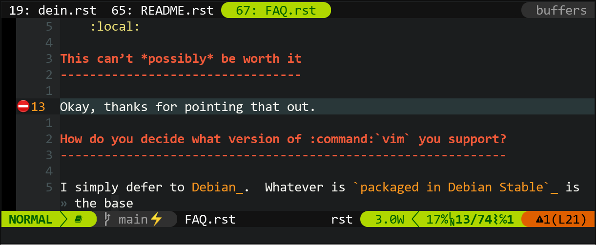

vim-configs
===========

This is my personal vim_ configuration that is shared among hosts.  Maybe
they’re useful to you too, or — better yet — you’ll spot *and* fix a bug!

It uses features introduced in version 8.0, but should work with later versions.
It will *not* work with neovim_, and that is unlikely to change in the near
future.

If you find any problems with the files in this repository either file an
issue_, or drop me an mail_.  However, please do not report problems when using
neovim_, pull requests are fine though.

Poke around in the ``.rst`` files to see how things work, and be forewarned that
it isn’t for the faint of heart!

Contributors
------------

I’d like to thank the following people who have contributed to ``vim-configs``.

Patches
'''''''

* <your name here>

Bug reports
'''''''''''

* Delphine Beauchemin

Ideas
'''''

* Nathan McGregor

If I’ve forgotten to include your name I wholeheartedly apologise.  Just drop me
a mail_ and I’ll update the list!

.. _vim: https://www.vim.org/
.. _neovim: https://neovim.io/
.. _issue: https://github.com/JNRowe/vim-configs/issues/
.. _mail: jnrowe@gmail.com
